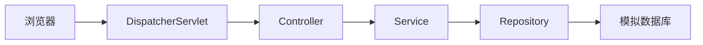
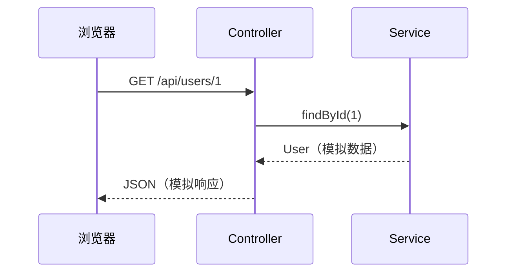

# Spring Boot 请求生命周期

## 逐步观察请求

这是一条简化的教学路径，省略过滤器、安全认证、事务代理等细节。Repository 在真实项目中可能使用 JPA、MyBatis 或其他实现。

<SpringBootRequestFlow />

## 流程图

```mermaid
flowchart LR
  A[浏览器] --> B[DispatcherServlet]
  B --> C[Controller]
  C --> D[Service]
  D --> E[Repository]
  E --> F[模拟数据库]
```

## 时序图

```mermaid
sequenceDiagram
  participant B as 浏览器
  participant C as Controller
  participant S as Service
  B->>C: GET /api/users/1
  C->>S: findById(1)
  S-->>C: User（模拟数据）
  C-->>B: JSON（模拟响应）
```
